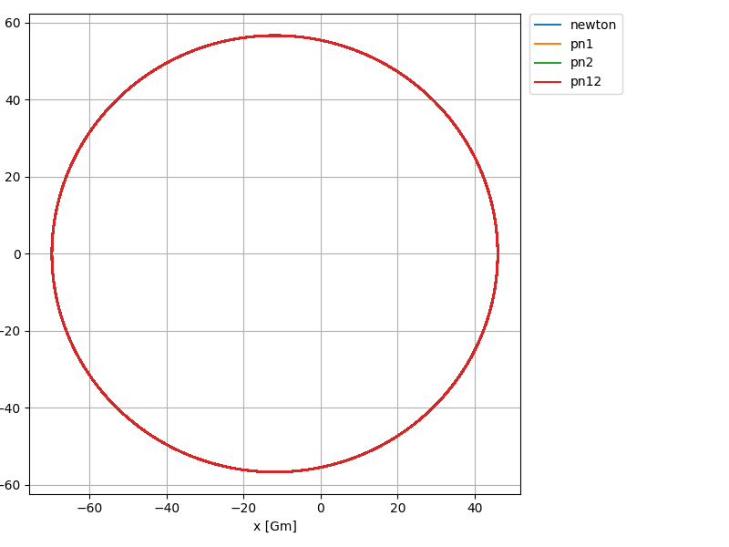
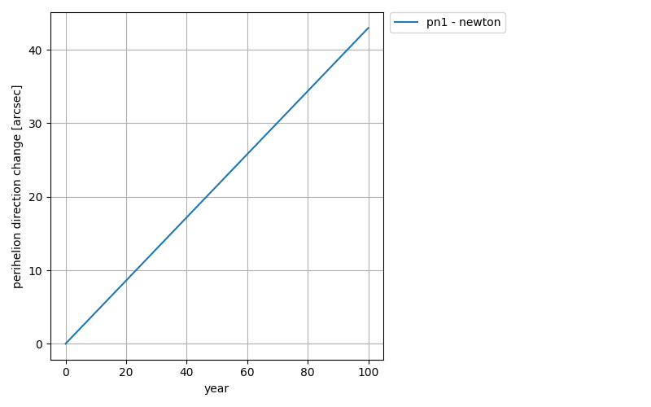
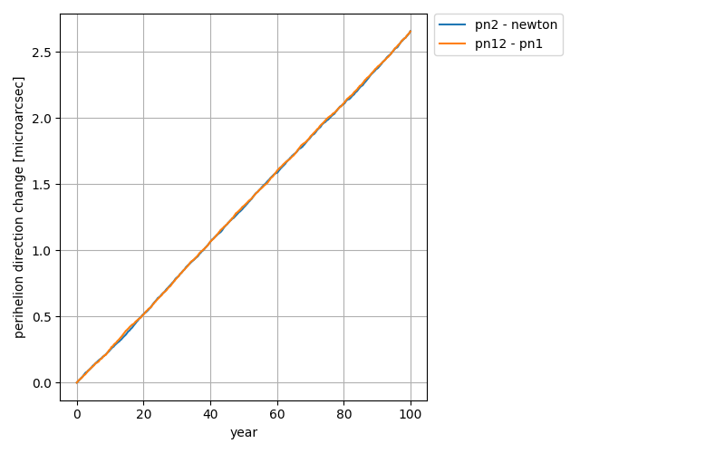

# 水星軌道シミュレーション（Newton / 1PN / 2PN）バリテーション報告

## 要旨
太陽—水星の2体問題に対し、ニュートン重力（Newton）、一般相対論1次補正（1PN）、および2PN direct項（Iorio 2020 の式(1)に基づく加速度）を実装し、**近日点移動（perihelion precession）**が理論・文献の期待と整合することを確認した。  
結果として、Newtonでは近日点移動は 0、1PNでは **≈ 42.9826 arcsec/century** と理論値 **≈ 42.9826 arcsec/century** に一致、2PN direct項は **≈ 2.66 μas/century** のオーダで再現された。さらに、合成モデル差分 **(pn12 − pn1)** が **(pn2 − newton)** と一致することから、モデル加算構造の自己整合を確認した。

---

## 1. 背景と目的
水星の近日点移動は、ニュートン力学の2体問題では閉軌道となり（理想化すれば）近日点方向は回転しない。一方、一般相対論補正を導入すると、1PNで有名な **約 43 arcsec/century** の近日点移動が生じる。  
さらに2PN（direct項）は非常に小さく、**μas/century** オーダである。

本報告の目的は、実装した数値積分コードがこの階層構造（Newton=0 / 1PN=arcsec / 2PN=μas）を正しく再現していることを、**理論式との一致**および**自己整合チェック**によって示すことである。

---

## 2. 検証の合格条件
以下を満たすことを「意図通り実装できている」と判断する。

1. **Newtonのみ**：近日点移動率 ≈ 0 arcsec/century  
2. **1PN**：近日点移動率が理論値（Einstein 1PN）と一致（≈ 43 arcsec/century）  
3. **2PN direct項のみ**：近日点移動率が μas/century オーダで出る  
4. **自己整合**：2PN寄与がモデル差分で一致  
   - `pn12 - pn1 ≈ pn2 - newton`

---

## 3. モデルと数値計算方法

### 3.1 状態量と運動方程式
状態は 3次元の位置・速度：
- `y = [x, y, z, vx, vy, vz]`

運動方程式：
- `dr/dt = v`
- `dv/dt = a(r, v)`

### 3.2 加速度モデル（ワンタッチ切替）
モデルは以下の4種を切替可能とした。

- **newton**：`a = a_N`
- **pn1**：`a = a_N + a_1PN`
- **pn2**：`a = a_N + a_2PN`（direct 2PN単独確認用）
- **pn12**：`a = a_N + a_1PN + a_2PN`

ここで
- `a_N`：万有引力（中心力）
- `a_1PN`：調和座標系における標準的な1PNテスト粒子加速度（Schwarzschild場の既知の近日点移動と比較可能）,Eq.(10)
- `a_2PN`：Iorio(2020) Eq.(1) の **direct 2PN** 加速度

### 3.3 近日点の検出（イベント検出）
近日点は「距離が極小」と同値な条件として、
- `dr/dt = 0`（半径方向速度が0）

を用い、`solve_ivp` の **イベント検出（root finding）**で近日点時刻列とその状態を取得した。

### 3.4 近日点方向の評価（μas級に対する根本対策）
μas級の2PNを差分で評価する際、各モデルが持つ「近日点時刻の微小ズレ」が差分角に混入し、見かけ上のギザギザ（数値ノイズ）になることがある。  
この誤差源を避けるため、本検証では以下の「同一時刻評価」を採用した。

- 共通時刻グリッド：**Newtonモデルの近日点時刻列** `t_grid` を採用  
- 各モデル：`dense_output=True` により `sol.sol(t_grid)` で同一時刻に補間評価  
- 近点方向：補間した状態 `(r, v)` から偏心（LRL）ベクトル
  $$\mathbf e = \frac{\mathbf v \times \mathbf h}{\mu}-\frac{\mathbf r}{r},\quad \mathbf h=\mathbf r\times \mathbf v$$
  を計算し、その角度 `atan2(e_y, e_x)` を「近点方向」として採用  
- `unwrap` で連続化し、差分系列を作成（初期値オフセット除去）

この方法により、**pn2-newton と pn12-pn1 の差分系列がほぼ完全に一致**し、2PNの寄与を安定に比較できることを確認した。

---

## 4. 理論値との比較方法

### 4.1 1PN理論値（Einstein 1PN）
既知の1PN近日点移動（1軌道あたり）：
$$\Delta\omega = \frac{6\pi\mu}{a(1-e^2)c^2}$$
をケプラー周期から「世紀あたり」へ換算し、`arcsec/century` として比較した。

### 4.2 direct 2PN理論値（Iorioの式）
Iorioで与えられる direct 2PN の歳差率
$$\dot{\omega}^{(2\mathrm{PN})}_{\mathrm{dir}}
= n_b\frac{\mu^2(28-e^2)}{4c^4a^2(1-e^2)^2}$$
を `arcsec/century` に換算して比較した。

---

## 5. 実行設定（概要）
- 期間：100年
- `SCALE_C = 1.0`（物理値の光速）
- 近日点イベント数：416（Newton）
- 積分：`DOP853`、`dense_output=True`（同一時刻評価のため）

---

## 6. 実行結果（ログ）
以下は 100年積分の結果（Newton基準の差分表示）。

```text
============================================================
SCALE_C         : 1.0  (c_eff = c / SCALE_C)
YEARS_LONG      : 100.0
perihelia used  : 416  (Newton)
------------------------------------------------------------
MODEL           : newton
fit rate        : 0.000000 arcsec/century  (difference vs Newton)
------------------------------------------------------------
MODEL           : pn1
fit rate        : 42.982622 arcsec/century  (difference vs Newton)
theory 1PN      : 42.982643 arcsec/century  (Einstein 1PN)
pn1 - theory    : -20.937 microarcsec/century  (indirect-2PN scale check)
------------------------------------------------------------
MODEL           : pn2 (Eq.(1) only)
fit rate        : 0.000002659 arcsec/century  (difference vs Newton)
theory 2PN(dir) : 0.000002666 arcsec/century  (direct 2PN theory)
pn2 - theory    : -0.008 microarcsec/century
------------------------------------------------------------
MODEL           : pn12 (1PN + Eq.(1))
fit rate        : 42.982625 arcsec/century  (difference vs Newton)
pn12 - pn1      : 2.656 microarcsec/century  (direct-2PN scale check)
============================================================
```

---

## 7. 結果の解釈

### 7.1 Newton（万有引力のみ）
- `newton - newton = 0 arcsec/century`

**解釈**：  
2体ニュートン重力において近日点が回らないという期待と整合。単位系や初期条件、積分設定が破綻していないことの強いチェックになる。

### 7.2 1PN（相対論1次補正）
- 数値：`42.982622 arcsec/century`
- 理論：`42.982643 arcsec/century`
- 差：`-20.937 μas/century`

**解釈**：  
有名な 1PN近日点移動（≈43 arcsec/century）を再現し、理論値と一致している。  
差が μas/century オーダに収まっている点は、有限期間での線形フィット、短周期成分、理論換算（固定a,eを用いた近似）などを含む誤差として妥当な範囲と考えられる。

**補足（`pn1 - theory` のμas差が `pn2 - theory` より大きい点）**：  
これは「2PNが埋もれた」というより、**比較しているスケールが全く異なる**ために起きる自然な現象と解釈できる。  
1PNは 43 arcsec/cty（= 4.3×10^7 μas/cty）の巨大な傾きであり、そこに有限期間近似や短周期成分が混ざると μas級のバイアスが残り得る。一方2PNは元々μas級で、今回の同一時刻評価により差分評価が安定したため、理論との差がさらに小さく見える。

### 7.3 2PN（direct項のみ）
- 数値：`2.659 μas/century`（= `0.000002659 arcsec/century`）
- 理論：`2.666 μas/century`（= `0.000002666 arcsec/century`）
- 差：`-0.008 μas/century`

**解釈**：  
direct 2PNが期待通り μas/century オーダで得られ、理論式とも整合。係数、`c` のべき、符号などの実装が妥当であることを強く示唆する。

### 7.4 自己整合チェック（pn12 − pn1）
- `pn12 - pn1 = 2.656 μas/century`
- `pn2 - newton = 2.659 μas/century`

**解釈**：  
`pn12` は `pn1` に 2PN direct項を加えたものなので、差分 `pn12 - pn1` は direct 2PNそのものになるはずである。  
この差分が `pn2 - newton` と一致することから、モデルの加算・切替構造が自己整合している。

---

## 8. 図(計算結果の可視化)

### 図1：軌道図（xy平面）




**読むポイント**
- 4モデルの軌道形状がほぼ重なり、発散や暴走がない（PN項が過大に効いていない）
- 近日点移動そのものは見た目で分かりにくいので、図2・図3で差分角を評価する

### 図2：近日点方向角の変化（1PN：arcsec vs year）




**読むポイント**
- `pn1 - newton` がほぼ直線的に増加
- 100年で ≈ 43 arcsec（≈ 0.43 arcsec/year）に到達し、理論と整合

### 図3：direct 2PNの差分比較（μas vs year）




**読むポイント**
- `pn2 - newton` と `pn12 - pn1` がほぼ一致（自己整合）
- 100年で ≈ 2.66 μas に到達（μas/ctyオーダ）

---

## 9. 生成物（出力ファイル）
- `mercury_pn_validation_summary.txt`：実行ログ（数値結果の根拠）
- `mercury_pn_validation_series.csv`：時系列データ  
  - `year`
  - `pn1_minus_newton_arcsec`
  - `pn2_minus_newton_microarcsec`
  - `pn12_minus_pn1_microarcsec`

---

## 10. 結論
- Newtonのみ：近日点移動 ≈ 0（期待通り）
- 1PN：理論値（Einstein 1PN）と一致する ≈ 43 arcsec/century を再現
- direct 2PN：理論通り μas/century オーダで再現
- 自己整合：`pn12 - pn1 ≈ pn2 - newton` が成立

以上より、本実装は **Newton / 1PN / 2PN（direct項）を意図通り反映**していると判断できる。

---

## 11. 追加検証（必要になった場合の最小セット）
一次報告としては「理論一致＋自己整合」で十分強いが、完成度を小コストで上げるなら次が有効。

1. **PN次数スケーリング則**：`SCALE_C` を変化させ  
   - 1PN効果 ∝ `SCALE_C^2`  
   - 2PN効果 ∝ `SCALE_C^4`  
   を確認（次数の取り違え検出に強い）
2. **収束チェック**：`rtol/atol/max_step` を2〜3通り振り、2PN差分（μas/cty）の傾きが安定することを確認（誤差バー提示）
